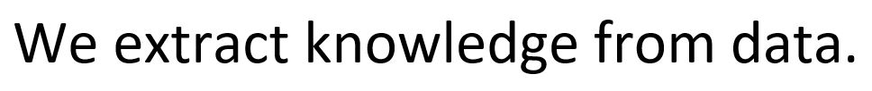
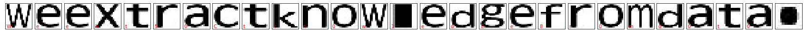

# Optical character recognition

This project attempts to apply different machine learning techniques in optical character recognition (OCR). A dataset of 337,481 images of basic alphabet characters in 153 different fonts is used to train the models. 

  
  

## Some results
Linear SVM and SVM with RBF kernel are the first candidate models to try out. However due to the fact that those 2 models cannot handle that huge amount of data in the dataset, the number of images is reduced to under 100K by selecting only common fonts. PCA is also used to cut down the size of the data. As expected, the resulting accuracy on the test set of SVM with RBF kernel is better than that of the linear SVM. However, when applying the SVM with RBF kernel model to real-world scenarios, the result is far from acceptable.

Hence, the use of the whole dataset in training is neccesary. SGDClassifier (linear SVM + mini-batch training) is selected. Also, Kernel approximation (RBF) is utilized to introduce non-linearity into the model. The final result is impressive based on the fact the this is a simple project with insufficient data preprocessing and relatively small amount of data.

## Disclaimer
**This software is published for academic and non-commercial use only.**

## Acknowledgement

* This work was done by Vien Bui, Caren Alexander, and Sumanth Bail at *the University of Alabama at Birmingam*.

* The Character Font Images dataset is obtained from [UCI machine learning repository](https://archive.ics.uci.edu/ml/datasets/Character+Font+Images).

## Contact
Feel free to contact me if there is any question (Vien Bui bnvien@gmail.com).
